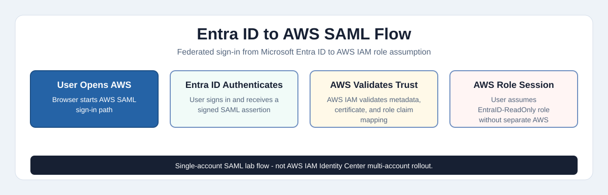

# Microsoft Entra ID to AWS SAML 2.0 SSO Integration

> **Configured and tested in lab** — SAML SSO federation between Microsoft Entra ID and AWS Single-Account Access, documented as a self-directed identity and cloud access case study.

---

## The Scenario

A growing fintech company runs its internal tools and user identities on **Microsoft 365 and Entra ID**, but its engineering and DevOps teams also need access to **Amazon Web Services** for cloud infrastructure work.

The problem: managing separate AWS usernames and passwords for every engineer is a security risk. When someone leaves the company, IT has to remember to remove them from AWS separately. If they forget, that is an open door.

The solution: **federate AWS access through Entra ID using SAML 2.0 SSO**. Engineers authenticate with Microsoft credentials, and AWS trusts the signed SAML assertion from Entra ID. This reduces separate AWS password usage, lowers orphaned account risk, and centralizes identity-provider sign-in evidence.

This is **Zero Trust** in practice — *identity is the perimeter*.

---

## Architecture Scope

This repository demonstrates the **AWS Single-Account Access enterprise application** pattern in Microsoft Entra ID with AWS IAM SAML role federation.

It does **not** claim a full AWS IAM Identity Center multi-account rollout. Some AWS console screens reference IAM Identity Center guidance because AWS surfaces related identity options in the console, but the documented implementation path is:

1. Microsoft Entra ID enterprise application
2. SAML-based sign-on configuration
3. AWS IAM SAML identity provider
4. AWS IAM role trust relationship
5. Entra ID role claim mapping
6. AWS console access through federated role assumption

---

## What Was Built

### Microsoft Entra ID Side (Identity Provider)

- Added **AWS Single-Account Access** as an Enterprise Application
- Configured AWS Single-Account Access SAML 2.0 settings through the Microsoft Entra gallery workflow:
  - **Identifier / Entity ID:** fixed by the AWS gallery workflow
  - **Reply URL (ACS):** `https://signin.aws.amazon.com/saml`
- Mapped user attributes sent in the SAML assertion:
  - UPN as unique user identifier
  - Given name, surname, email as user profile
  - **Role ARN** mapping directly to the AWS IAM role the user assumes
  - Session duration set to 900 seconds for shorter federated sessions
- Managed **Token Signing Certificate** lifecycle (RS256, expires 2029)
- Assigned users to the application for access control
- Exported **Federation Metadata XML** for AWS trust configuration

### Amazon Web Services Side (Service Provider)

- Registered **EntraID** as a trusted **SAML 2.0 Identity Provider** in AWS IAM
- Uploaded Federation Metadata XML to establish cryptographic trust
- Created **EntraID-ReadOnly** IAM Role with SAML 2.0 federation trust policy
- Mapped the full Role ARN back into Entra ID attribute claims

---

## How the SSO Flow Works



This flow shows the lab federation path from user sign-in through Entra ID, SAML assertion issuance, AWS IAM trust validation, role assumption, and AWS Console access.

[View interactive HTML version](https://rahatislamanik-spec.github.io/EntraID-AWS-SAML-SSO-Integration/docs/entra-aws-saml-authentication-flow.html)

```
User opens AWS in their browser
         |
         v
Redirected to Microsoft Entra ID login
         |
         v
User authenticates (password + MFA if required)
         |
         v
Entra ID generates a signed SAML assertion
(contains user identity + assigned AWS role ARN)
         |
         v
Assertion posted to AWS ACS URL
         |
         v
AWS validates signature against EntraID metadata
         |
         v
User assumes EntraID-ReadOnly IAM Role
         |
         v
AWS Console opens -- no separate AWS credentials used
```

---

## The Result

- User authenticated through Entra ID and landed directly in the AWS Console
- Role path documented as `EntraID-ReadOnly/user@example.com`
- Separate long-term AWS user credentials were not required for the federated user path
- Entra ID sign-in evidence is centralized at the identity provider; AWS CloudTrail validation is listed as future evidence

---

## Relevance to Regulated Industries

In Canadian financial institutions operating under OSFI E-21 and FINTRAC expectations, cross-platform identity federation is a common control pattern for reducing unmanaged access. When engineering and DevOps teams access AWS infrastructure using separate credentials, the organization faces three risks: orphaned accounts when staff leave, split audit trails across two platforms, and inconsistent MFA or Conditional Access enforcement.

Federating AWS access through Microsoft Entra ID helps address these risks by making Entra ID the front door for authentication. In a production rollout, assignment removal, Conditional Access, session lifetime, AWS role trust, and CloudTrail monitoring would all need to be validated together. This lab demonstrates the federation path and documents the next evidence needed for production-grade assurance.

---

## Tech Stack

| Component | Technology |
|-----------|-----------|
| Identity Provider (IdP) | Microsoft Entra ID (Azure AD) |
| Service Provider (SP) | Amazon Web Services IAM |
| Federation Protocol | SAML 2.0 |
| Role Mapping | IAM Role ARN via SAML attribute claim |
| Certificate | RS256 Token Signing Certificate |
| Access Policy | AWS ReadOnlyAccess (managed) |

---

## Key Concepts Demonstrated

**SAML 2.0 Federation** - industry standard for enterprise SSO between cloud platforms

**Zero Trust Identity** - no implicit trust, every access request verified through the central identity provider

**Least Privilege Access** - ReadOnlyAccess policy grants minimum required permissions

**Certificate Lifecycle Management** - token signing certificate tracked with expiry monitoring

**Attribute-Based Access Control** - AWS role assignment driven by Entra ID attribute claims

**Audit Trail** - identity-provider sign-in evidence is centralized in Entra ID; AWS-side CloudTrail evidence is a planned validation item

---

## Validation Boundaries

| Area | Status | Notes |
|---|---|---|
| Entra enterprise application | Configured | AWS Single-Account Access application shown in Entra ID |
| SAML sign-on settings | Configured | AWS gallery workflow and ACS URL documented |
| AWS IAM identity provider | Configured | AWS IAM SAML provider and trust path shown |
| AWS IAM role | Configured | ReadOnlyAccess role created for federated access |
| Federated console access | Tested | AWS console access shown after SSO flow |
| Conditional Access / MFA policy | Not evidenced | Future enhancement |
| Deprovisioning test | Not evidenced | Future enhancement |
| CloudTrail sign-in evidence | Not evidenced | Future enhancement |
| Production deployment | Not claimed | Self-directed lab case study |

For a screenshot-by-screenshot evidence summary, see [docs/evidence-map.md](docs/evidence-map.md).

---

## Screenshots - Build Evidence

### Entra ID Configuration


**Step 1 - Entra Tenant and Admin Context**


**Step 2 - Enterprise Applications View**


**Step 3 - Browse Microsoft Entra App Gallery**


**Step 4 - AWS Single-Account Access Application Overview**


**Step 5 - Users and Groups Assignment View**


**Step 6 - SAML Settings Save Prompt and Attribute Claims**


**Step 7 - Users and Groups Section**


**Step 8 - AWS IAM Identity Center Guidance Screen**


**Step 9 - Entra Assignment Confirmation**


**Step 10 - AWS IAM Identity Center Related Services Screen**


### AWS IAM Configuration

**Step 11 - AWS IAM Dashboard**


**Step 12 - Entra Basic SAML Configuration Screen**


**Step 13 - Create AWS Role with SAML Federation**


**Step 14 - ReadOnlyAccess Policy Selected**


**Step 15 - Role Name and Review**


**Step 16 - EntraID-ReadOnly Role Created**


### Final Configuration and Proof

**Step 17 - Role Claim Mapping in Entra ID**


**Step 18 - AWS Console Access After SSO Flow**


**Step 19 - Entra ID SSO Test Panel**


---

## Security Note

The Federation Metadata XML used in this integration is not included in this repository. It contains tenant-specific configuration data including identity provider URLs, certificate information, and directory identifiers that are not suitable for public repositories. Federation Metadata XML is available on request.

---

## What is Next

- Add Conditional Access policy evidence for AWS access
- Expand to multiple AWS roles based on Entra ID group membership
- Automate user assignment via PowerShell and Microsoft Graph API
- Add AWS CloudTrail evidence of federated sign-in events
- Add deprovisioning validation showing assignment removal and session behavior

---

## Author

**Md Rahat Islam Anik**
Identity & Cloud Operations Specialist · Toronto, Canada
[linkedin.com/in/rahatislamanik](https://linkedin.com/in/rahatislamanik) - [github.com/rahatislamanik-spec](https://github.com/rahatislamanik-spec)
